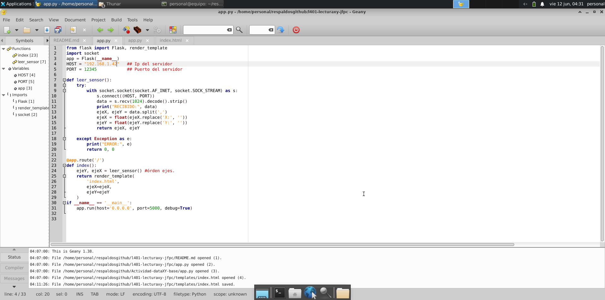
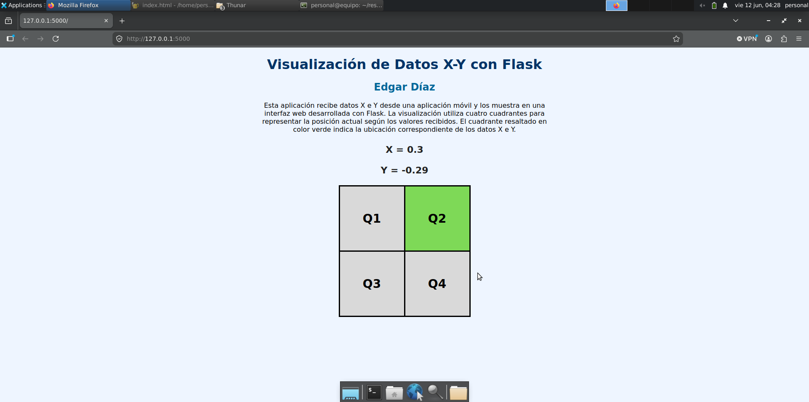

# Visualización de Datos X-Y con Flask

## Autor

Edgar Díaz

---

## Descripción

Este proyecto fue desarrollado utilizando Flask, HTML, CSS y Jinja para visualizar datos X e Y recibidos desde una aplicación móvil.

La aplicación representa gráficamente la posición de los datos mediante cuatro cuadrantes. Dependiendo de los valores recibidos, el cuadrante correspondiente se ilumina para indicar la ubicación actual.

---

## Objetivo

Desarrollar una aplicación web capaz de recibir y visualizar datos X e Y enviados desde una aplicación móvil utilizando Flask.

---

## Tecnologías Utilizadas

* Python 3
* Flask
* HTML
* CSS
* Jinja
* GitHub

---

## Requisitos

* Python 3 instalado
* Flask instalado
* Aplicación móvil XYaTCPfull.apk
* Computador y celular conectados a la misma red local

---

## Archivo APK

La aplicación utilizada para enviar los datos se encuentra incluida en este repositorio:

```text
XYaTCPfull.apk
```

---

## Ejecución del Proyecto

### Ejecutar Flask

```bash
python3 app.py
```

### Abrir en el navegador

```text
http://127.0.0.1:5000
```

---

## Estructura del Proyecto

```bash
.
├── app.py
├── capturas
│   ├── archivos-base.png
│   └── vista-base.png
├── README.md
├── templates
│   └── index.html
└── XYaTCPfull.apk
```

---

## Capturas

### Estructura de Archivos



---

### Vista de la Aplicación



---

## Funcionamiento

La aplicación recibe datos X e Y desde una aplicación móvil y actualiza automáticamente la página web.

La visualización utiliza cuadrantes para representar la posición de los valores recibidos. Cuando cambian los datos, el cuadrante correspondiente se resalta visualmente.

---

## Características Implementadas

* Visualización de datos X e Y.
* Actualización automática de la página.
* Diseño personalizado mediante CSS.
* Uso de Jinja para la lógica de visualización.
* Implementación sin JavaScript.
* CSS definido dentro de la etiqueta `<head>`.
* Uso exclusivo de identificadores (`id`) en CSS.

---

## Observaciones

Este proyecto fue desarrollado para la actividad "Visualización de Datos X-Y con Flask" de la asignatura Desarrollo de Software para Hardware.

La solución cumple con las restricciones establecidas, utilizando únicamente Flask, HTML, CSS y Jinja.

---
